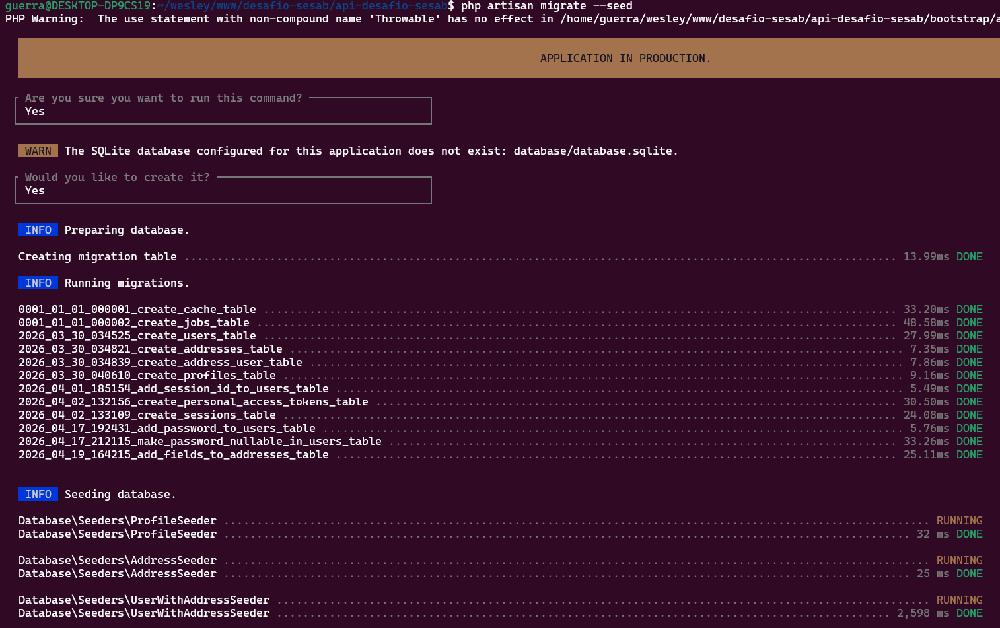

# 🚀 Desafio SEASB - Laravel


Projeto desenvolvido em **Laravel (PHP)** para o desafio técnico da SEASB.

---

## 🧰 Tecnologias

- PHP 8+
- Laravel Framework 13.5.0
- SQLite version 3.45.1
- Composer version 2.9.5
- Vite version 8.0.9
- Docker version 29.4.1
- Docker Compose version v5.1.3

### 1. Clonar o repositório

```bash
git clone git@github.com:Wesleygmssa/api-desafio-sesab.git
cd api-desafio-sesab
```

### 2. Instalar dependências

```bash
composer install
npm install
```


### 3. Rodar as migrações e seeders

⚠️ Observação importante:

Após configurar o projeto, é necessário rodar o seed para criar o usuário administrador padrão e permitir o acesso ao sistema.

Execute o comando:

```bash
php artisan migrate --seed
```

## Terminal comando para rodar as migrações e seeders



### 6. Iniciar o servidor de desenvolvimento

```bash
php artisan serve
```

### Opcional: Rodar em docker

```
Docker version 29.4.1
Docker Compose version v5.1.3
```

```bash
sudo docker compose up --build
```

### 👤 Usuário administrador padrão

Após executar o seed, utilize as credenciais abaixo para acessar o sistema:

```
Login: admin@teste.com
Senha: senha123
```

## 📂 Estrutura do Projeto

- `app/`: Contém a lógica de negócios, modelos, controladores e outros componentes do Laravel.
- `database/`: Contém as migrações, seeders e fábricas para o banco de dados.
- `resources/`: Contém as views, arquivos de idioma e ativos como CSS e JavaScript.
- `routes/`: Contém os arquivos de rotas para a aplicação.

## 📝 Licença

Este projeto está licenciado sob a [MIT License](LICENSE).

## 🤝 Contribuição

Contribuições são bem-vindas! Sinta-se à vontade para abrir issues ou enviar pull requests para melhorar o projeto.

## 📞 Contato

Para dúvidas ou sugestões, entre em contato através do email: [contato.wesleygm@gmail.com](mailto:contato.wesleygm@gmail.com)

---Feito com ❤️ por [Wesley Guerra](https://github.com/Wesleygmssa)
